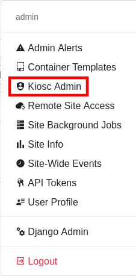
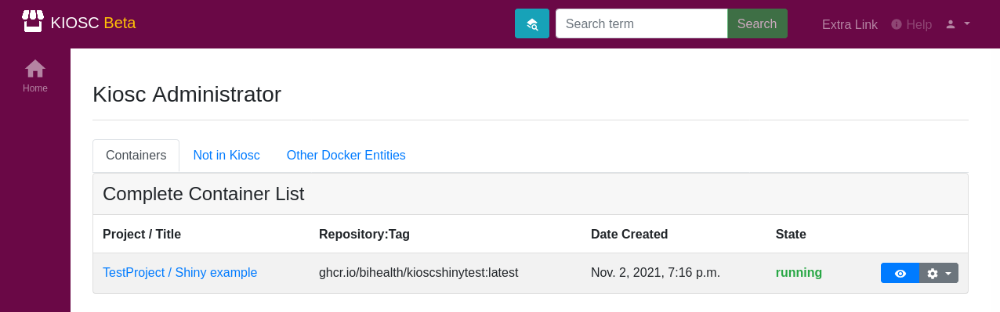
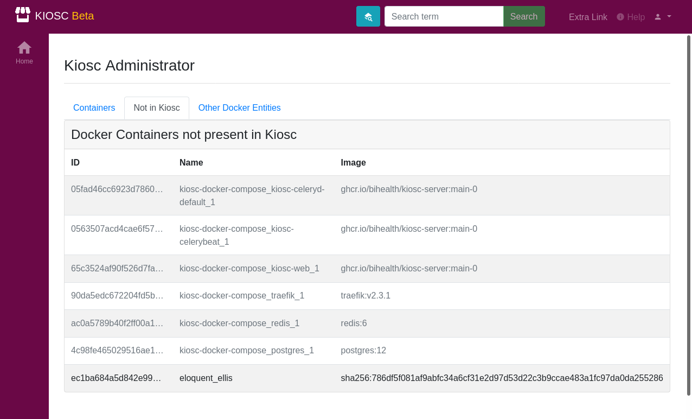
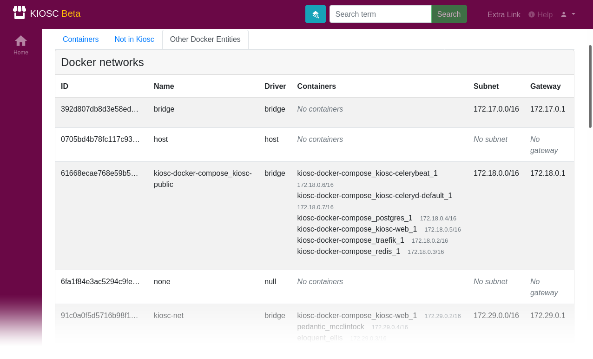
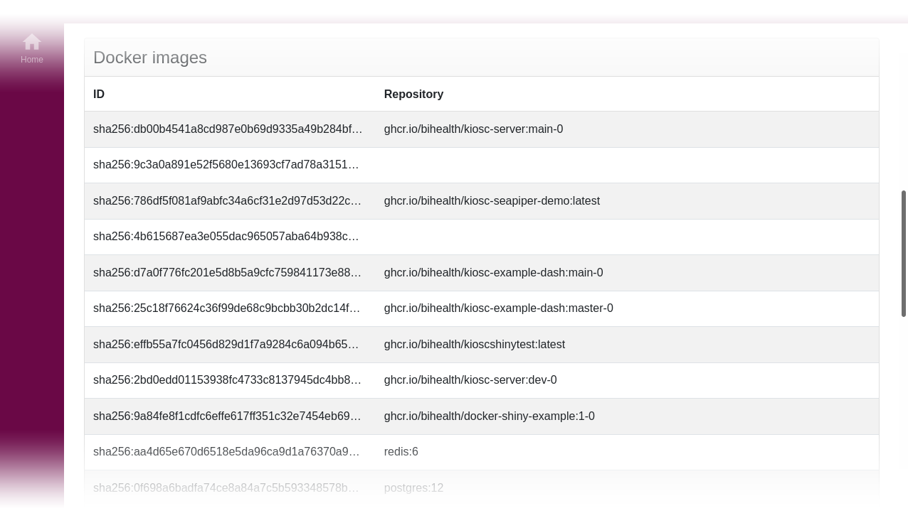
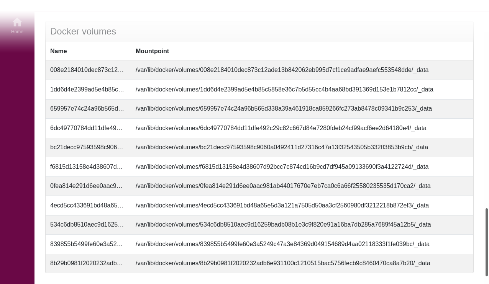

.. _administration_overview:

Overview
========

.. contents::

To access the administration interface for Kiosc containers (which
is not to confuse with the Django administration interface), click
on the user menu in the top right corner and choose *Kiosc Admin*.

This will open a page with three tabs: **Containers**, **Not in Kiosc** and **Other Docker Entities**.

Containers
^^^^^^^^^^

This tab lists all available containers that were created in Kiosc, with their current status
and the control menu to adjust the status of the container, or delete it.

Not in Kiosc
^^^^^^^^^^^^

This tab lists all running Docker containers that are not connected to a container object
in Kiosc. This is meant to list orphaned Docker containers, but it will also keep a list
of Docker containers that are part of the Kiosc server itself. They are grayed out.

Other Docker Entities
^^^^^^^^^^^^^^^^^^^^^

This tab lists other Docker entitites that are not containers and comprises three lists, **Docker networks**, **Docker volumes** and **Docker images**.

**Docker networks** list among other the identifier and the connected containers as well as the subnet and gateway of the network.

**Docker images** list the identifier and the repository and tag name.

**Docker volumes** list the identifier and mountpoint.

