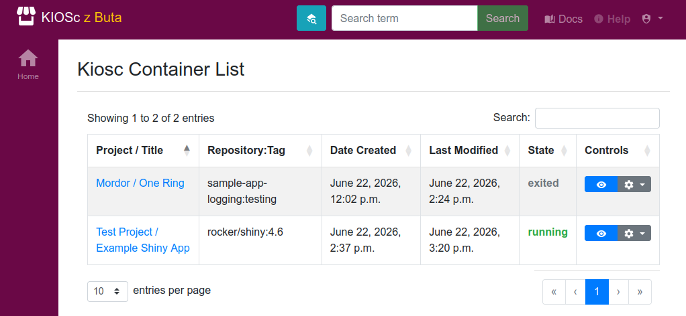

.. _apps_containerlist:

Container List
==============

The "Container List" app provides a bird's eye view of all your containers and their status.

The main view is essentially a table of all the containers across projects.
You can filter the content using the "Filter" input on the top right.
As always, the big blue eye button in the Controls will take you to the app, while the cog icon will open the container controls drop-down menu.

.. image:: figures/introduction/cookbook/container_list_app.png
  :alt: Container list

The container list app can be accessed from the top-right user-dropdown menu, as shown in the figure above.
