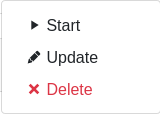
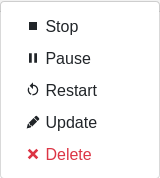
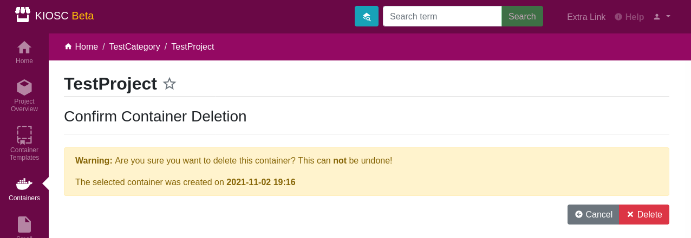

.. _apps_containers_controls:

Access & Controls
=================

.. contents::

Access (via Proxy)
------------------

The web application running inside of the container can be accessed
when clicking the button with the eye icon. A grey and crossed-out
eye indicates that the container is currently not running. A click
on the button will start the container and access the web application
afterwards.

A blue button with an eye icon indicates that the container is running.
The access will happen immediately when clicking the button.

Controls
--------

The ``Controls`` dropdown menu (cog icon) comprises
multiple actions that can be issued on a container,
displayed depending on the state the container is currently in.
In the details page this menu is presented by the cog icon + ``Controls``,
while in the list this is presented by the cog icon only.

The ``Controls`` button on the details page:

The ``Controls`` button on the container list:

When a container is stopped, the selection includes the actions
``Start``, ``Update`` and ``Delete``, given the permissions.

When a container is running, the selection includes the actions
``Stop``, ``Pause``, ``Restart``, ``Update`` and ``Delete``,
given the permissions.

Start
^^^^^

Create a container from a Docker image and start it.  If the image isn't
cached yet, it is pulled from the specified repository.  An existing
container is always wiped before performing the starting action.

Internally, the following cadence is performed::

    docker rm
    docker pull
    docker create
    docker run

The state should be **running** when performed successfully.

Stop
^^^^

Stop a running Docker container. Only available when Docker container state is reported as running.

Internally, a ``docker stop`` is performed.

The state should be **exited** when performed successfully.

Pause
^^^^^

Pause a running Docker container. Only available when Docker container state is reported as running.

Internally, a ``docker pause`` is performed.

The state should be **paused** when performed successfully.

Unpause
^^^^^^^

Unpause a paused Docker container. Only available when Docker container state is reported as paused.

A ``docker unpause`` is performed.

The state should be **running** when performed successfully.

Restart
^^^^^^^

Restart a running container. Only available when Docker container state is reported as running.

Internally, the following cadence is performed::

    docker stop
    docker rm
    docker pull
    docker create
    docker start

(It's NOT a ``docker restart`` as the name would suggest.)

The state should be **running** when performed successfully.

Update
^^^^^^

This leads to the form to update the setting of the current container.
Please note that values of items in the ``environment`` dictionary are
displayed as ``<masked>`` if listed in the ``environment_secret_keys``.
When left as ``<masked>``, the value itself will not change. To set a
new value, simply change the value.

If the Docker container state is reported as running, a restart as
described above will be performed to account for the changes.

Delete
^^^^^^

This makes sure that the associated Docker container is not running
and stops it if necessary, and deletes the Docker container as well
as the database object. This action can't be undone.

