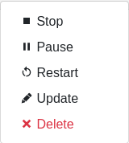
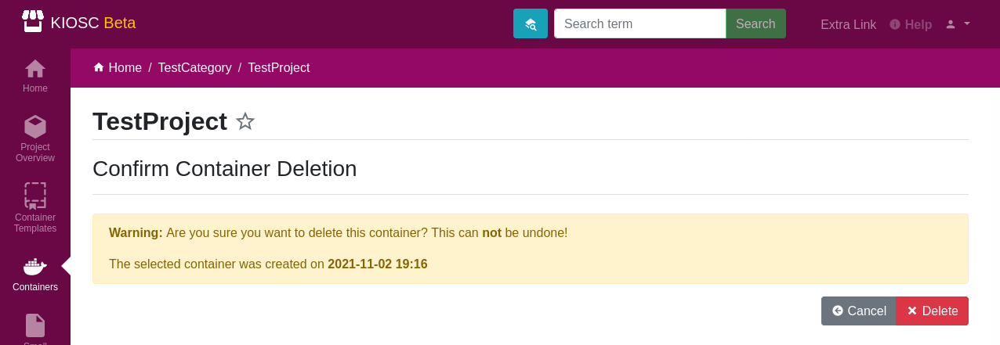

.. _apps_containers_controls:

Access & Controls
=================

.. contents::

Access (via Proxy)
------------------

The web application running inside of the container can be accessed
by clicking the blue button with the eye icon.

Controls
--------

The ``Controls`` dropdown menu (cog icon) comprises
multiple actions that can be issued on a container,
displayed depending on the state the container is currently in.
In the details page this menu is presented by the cog icon + ``Controls``,
while in the list this is presented by the cog icon only.

The ``Controls`` button on the details page:

The ``Controls`` button on the container list:

The dropdown menu for the Controls includes all the actions that
you can perform on the container. If you are not allowed to perform an action,
the corresponding button will not be shown.

Start
^^^^^

Create a container from a Docker image and start it. If the image isn't cached
yet, it is pulled from the specified repository. If you have used Docker from
the command line before, this control is roughly equivalent to a ``docker run``
command.

The state should be **running** when performed successfully.
If the container fails to start, the state will be either **created** or **failed**.

Stop
^^^^

Stop a running Docker container. If the container is not running, this action has no effect.

Internally, a ``docker stop`` is performed.

The state should be **exited** when performed successfully.

Pause
^^^^^

Pause a running Docker container.

Internally, a ``docker pause`` is performed.

The state should be **paused** when performed successfully.

Unpause
^^^^^^^

Unpause a paused Docker container.

A ``docker unpause`` is performed.

The state should be **running** when performed successfully.

Reset
^^^^^

Deletes and recreates the container.

Internally, the following cadence is performed::

    docker stop
    docker rm
    docker pull
    docker create
    docker start

The state should be **running** when performed successfully.

Update
^^^^^^

This leads to the form to update the setting of the current container.
Please note that values of items in the ``environment`` dictionary are
displayed as ``<masked>`` if listed in the ``environment_secret_keys``.
When left as ``<masked>``, the value itself will not change. To set a
new value, simply change the value.

Updating a container will also stop it.

Delete
^^^^^^

This makes sure that the associated Docker container is not running
and stops it if necessary, and deletes the Docker container as well
as the database object. This action can't be undone.

