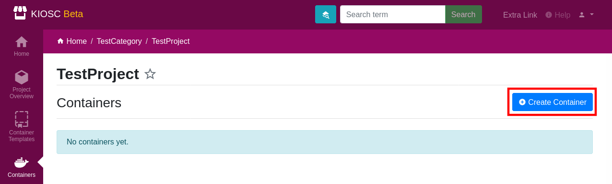
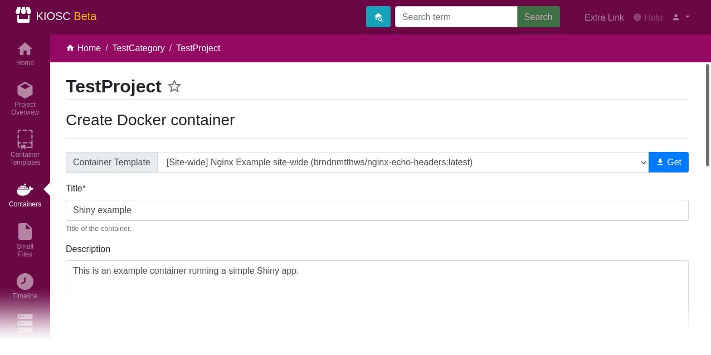
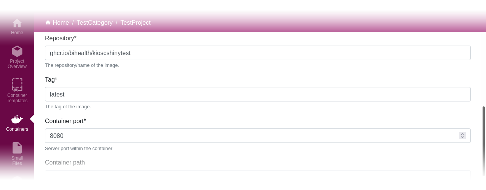
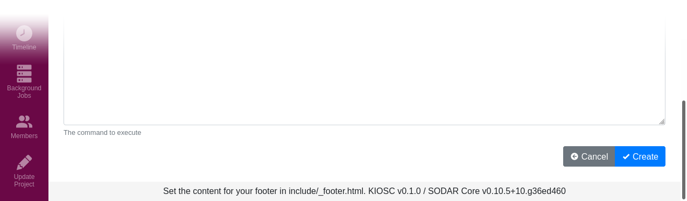

.. _apps_containers_create:

Create
======

.. contents::

Click the ``Create Container`` button to enter the form for creating
a new container object. This does not create a Docker container yet but
only gathers information. The actual Docker container is created when
starting the container.

Fill in at least the mandatory fields, marked with a star (*). Some of
them are pre-filled with a reasonable default value. Change only if required.
Others like ``Title``, ``Repository``, ``Tag`` and ``Container Port`` have to
be set by the user. Below is a detailed description of each form field. In the example
screenshots, we set up a Shiny app.

Fill in a reasonable title that helps you identify the container. The title must be
unique. A description is helpful, but not required.

Fill in the repository, tag and container port.

Click the ``Create`` button to create the container object.
This does not create the actual Docker container yet.

Container templates
^^^^^^^^^^^^^^^^^^^

To make use of the container templates, select a template from the
top-hand dropdown menu and click ``Get``. This will populate all form fields
that are set in the template with you create form. Anything you already
entered will be overwritten. The prefix ``[Site-wide]`` or ``[Project-wide]``
indicates whether this template is either a site-wide or a project-wide
template.

Environment
^^^^^^^^^^^

Environment variables can be specified using a JSON dictionary.
Top-level keys in the dictionary become the environmental variables visible to the app launched
in the container::

    {
        "ID": "My container",
        "LIST": [ "A", "B", "C" ]
    }

Given the above example, two environment variables will be defined: ``ID``
and ``LIST``.  The contents of ``ID`` will be ``My container``; the contents of
``LIST`` will be ``[ 'A', 'B', 'C' ]``. Note that the double quotes will be
changed to single quotes.

These variables are available to the web app of the container,
and can be used to specify e.g. a data source or other parameters
for the container web app.

In addition to the user defined variables, the ``title``, ``description`` and
``container_port`` are also exposed as environment variables to the Docker container
(as ``TITLE``, ``DESCRIPTION`` and ``CONTAINER_PORT`` respectively).
The complete list looks like this::

    {
        "ID": "My container",
        "LIST": [ "A", "B", "C" ],
        "TITLE": "Some title",
        "DESCRIPTION": "Some description",
        "CONTAINER_PORT": 8080,
    }

Environment secret keys
^^^^^^^^^^^^^^^^^^^^^^^

Environment secret keys is a comma-separated list of sensitive keys to environment variables that have to
have a corresponding key defined in the JSON dictionary in the ``environment`` field.
Those variables will be masked when editing them or viewing the details of the container.

Container path
^^^^^^^^^^^^^^

The container path is the folder structure appended to the web address of
the container.

Timeout
^^^^^^^

The timeout is set in seconds and is set as the time limit for any Docker
action (start/stop/etc..) to complete.

Heartbeat URL (inactive)
^^^^^^^^^^^^^^^^^^^^^^^^

The heartbeat URL can be used to check whether the container app runs
correctly. (Feature is currently inactive)

Files
^^^^^

This dropdown provides the files that were uploaded to Kiosc via the ``Small Files``
app to the project the current container is created in.

To get the internal link to the file the container then can access, click ``Insert``
and the link will be appended to the ``command`` field.

Max retries
^^^^^^^^^^^

Maximal number of retries for an action in case of failure. If an action
(e.g. starting a container) fails, it will be retried this many times.

Inactivity threshold
^^^^^^^^^^^^^^^^^^^^

Number of days the container is allowed to run without proxy access.
If this threshold is hit, the container will be stopped.
