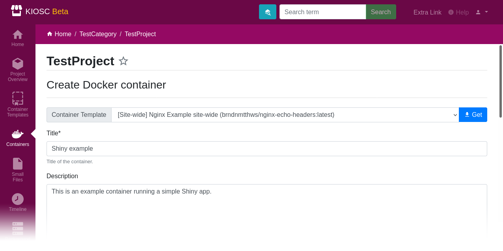
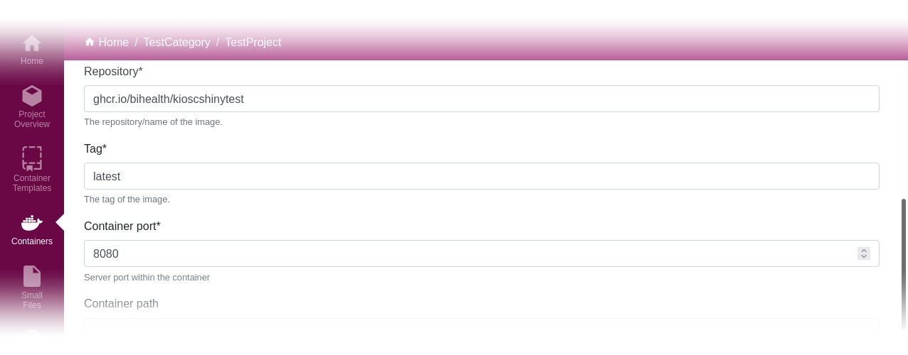
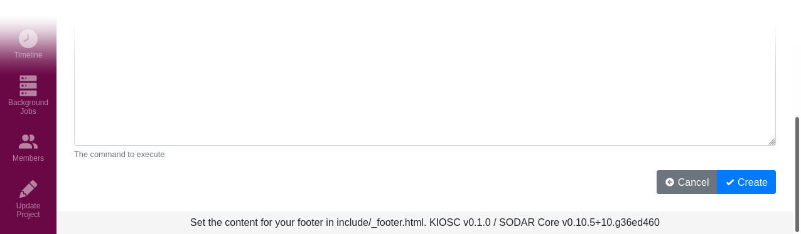
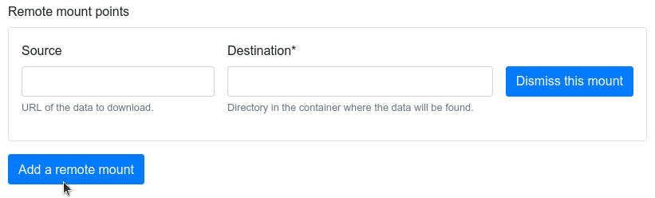

.. _apps_containers_create:

Create
======

.. contents::

Click the ``Create Container`` button to enter the form for creating
a new container object. This does not create a Docker container yet but
only gathers information. The actual Docker container is created when
starting the container.

.. image:: figures/apps/containers/overview_create.png
  :alt: Create container

Fill in at least the mandatory fields, marked with a star (*). Some of
them are pre-filled with a reasonable default value. Change only if required.
Others like ``Title``, ``Repository``, ``Tag`` and ``Container Port`` have to
be set by the user. Below is a detailed description of each form field. In the example
screenshots, we set up a Shiny app.

Fill in a reasonable title that helps you identify the container. The title must be
unique. A description is helpful, but not required.

Fill in the repository, tag and container port.

After filling the form, click the ``Create`` button to create the container object.
This does not create the actual Docker container yet.

Container templates
^^^^^^^^^^^^^^^^^^^

It is often the case that the same type of container will be used multiple times
across the site. To save some time and reduce the chances of mistakes, Kiosc
provides container templates. To make use of them, select a template from the
top-hand dropdown menu. This will populate all form fields that are set in the
template with you create form. Anything you already entered will be overwritten.
The prefix ``[Site-wide]`` or ``[Project-wide]`` indicates whether this template
is either a site-wide or a project-wide template. By default, one template for
an example Shiny app is available (it does not contain any meaningful data and
is just meant as a toy example). Admins can then create additional site-wide
templates.

Registry user and Registry password
^^^^^^^^^^^^^^^^^^^^^^^^^^^^^^^^^^^

If the Docker image is hosted in a private container registry, you can specify the user and password credentials in the form.
For example, if the image is in a `GitLab container registry <https://docs.gitlab.com/user/packages/container_registry/>`__, you will first need to generate an access token first, and then use it as the ``Registry password`` field.
In general, images can be downloaded from private registry only after running the ``docker login`` `command <https://docs.docker.com/reference/cli/docker/login/>`__.
The fields ``Registry user`` and ``Registry password`` mirror the credentials that you have to ender with ``docker login``.
Note that after creating the container the credentials will not be visible anymore, but they will be replaced everywhere by a ``<masked>`` token.

Container port
^^^^^^^^^^^^^^

In this field, enter the port number which the web app listens on.

Container path
^^^^^^^^^^^^^^

The container path is the folder structure appended to the web address of
the container.

Environment
^^^^^^^^^^^

You can pass arbitrary environment variables to the app running in the container.
These variables can be used to specify e.g. a data source or other parameters
for the app. Enter environment variables as a JSON object: top-level keys in the
dictionary are the names of the variables visible to the app::

    {
        "ID": "My container",
        "LIST": [ "A", "B", "C" ]
    }

In theory, since environment variables are just strings, you should only pass strings as the values of the dictionary.
However, since it is often convenient to have some structure in an environment variable, Kiosc allows you to enter any valid JSON entity.
When the variable is passed to the container, the object is automatically serialized as a JSON string.
Given the above example, two environment variables will be defined: ``ID``
and ``LIST``.  Inside the container, the contents of ``ID`` will be the string ``My container``; the contents of
``LIST`` will be the string ``[ "A", "B", "C" ]``. Your app is expected to parse the environment variable as JSON and reconstruct a structured object from it.
For example, if your app is written in Python, you could write ``my_list = json.loads(os.getenv("LIST"))``.

.. versionchanged:: 0.6.2

    In earlier versions, the variable was serialized as a Python dictionary instead of a JSON object. This meant that, for example, the double quotes were converted to single quotes.

In addition to the user defined variables, the ``title``, ``description`` and
``container_port`` are also exposed as environment variables to the Docker container
(as ``TITLE``, ``DESCRIPTION`` and ``CONTAINER_PORT`` respectively).
The complete list looks like this::

    {
        "ID": "My container",
        "LIST": [ "A", "B", "C" ],
        "TITLE": "Some title",
        "DESCRIPTION": "Some description",
        "CONTAINER_PORT": 8080,
    }

Environment secret keys
^^^^^^^^^^^^^^^^^^^^^^^

Environment secret keys is a comma-separated list of sensitive keys to environment variables that have to
have a corresponding key defined in the JSON dictionary in the ``environment`` field.
Those variables will be masked when editing them or viewing the details of the container.

Remote mounts
^^^^^^^^^^^^^

.. versionadded:: 0.6.2

You can tell Kiosc to download data *before* the container even starts. These
data will still be available if the container is stopped and started again, so
using a remote mount can make containers start much faster. It can also simplify
your app, because it can just assume that the data are already available at a
given path, instead of having to download them.

Click "Add a remote mount", then enter the URL from which you want to download
data. The files will be downloaded *recursively*, so be careful what you ask
for. The URL can point to an HTTP, HTTPS, or FTP server. In the "Destination"
field, enter the directory where the container should find the data. Note that
this must be a directory name even if you download just one file: the file names
will be the same as in the original data. When the container starts, you can
point your app to the destination directory and the data will be already there.

The source URL is actually optional. If left blank, Kiosc will create an empty
persistent volume at the specified container path. Your app can then use it to
store data which will survive even if the container exits.

You can create up to 10 mount points by clicking "Add a remote mount" multiple
times. If you realize you don't need a mount that you already added, click
"Dismiss this mount" to remove it.

The data are downloaded for the first time when the container starts. To help
you know exactly what data are available and where they are, you will see a
directory listing of the "Destination" path in the container logs.

Command
^^^^^^^

Enter the command that the container should run as soon as it starts.

.. tip::

    You can make use of the environment variables defined above in this command line.

Timeout
^^^^^^^

The timeout is set in seconds and is set as the time limit for any Docker
action (start/stop/etc..) to complete.

Heartbeat URL (inactive)
^^^^^^^^^^^^^^^^^^^^^^^^

The heartbeat URL can be used to check whether the container app runs
correctly. (Feature is currently inactive)

Files
^^^^^

This dropdown provides the files that were uploaded to Kiosc via the ``Small Files``
app to the project the current container is created in.

To get the internal link to the file the container then can access, click ``Insert``
and the link will be appended to the ``command`` field.

Max retries
^^^^^^^^^^^

Maximal number of retries for an action in case of failure. If an action
(e.g. starting a container) fails, it will be retried this many times.

Inactivity threshold
^^^^^^^^^^^^^^^^^^^^

Number of days the container is allowed to run without proxy access.
If this threshold is hit, the container will be stopped.
