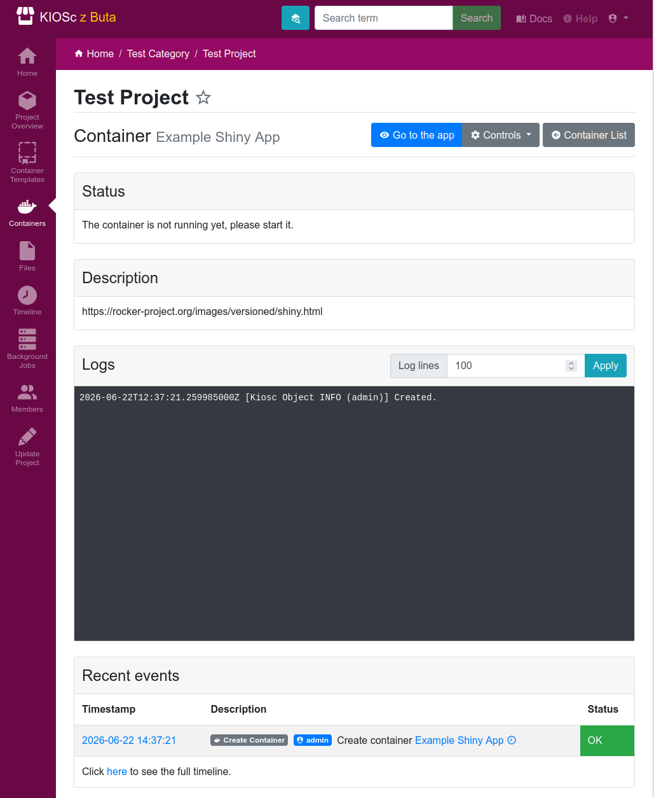
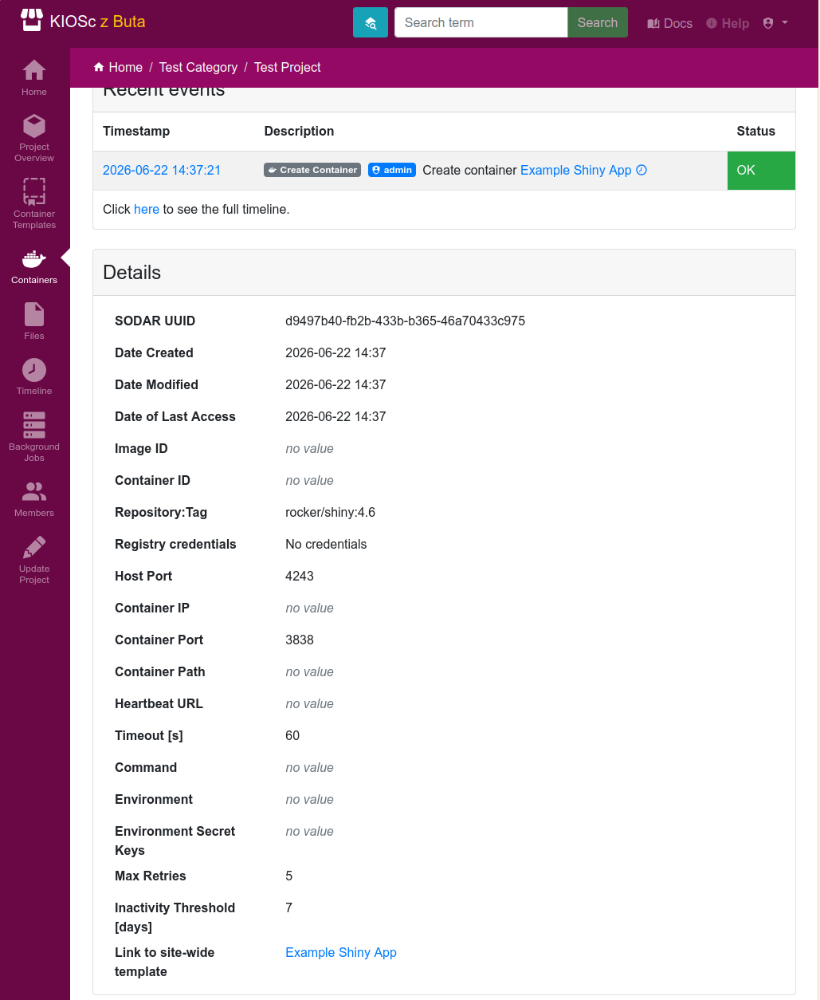
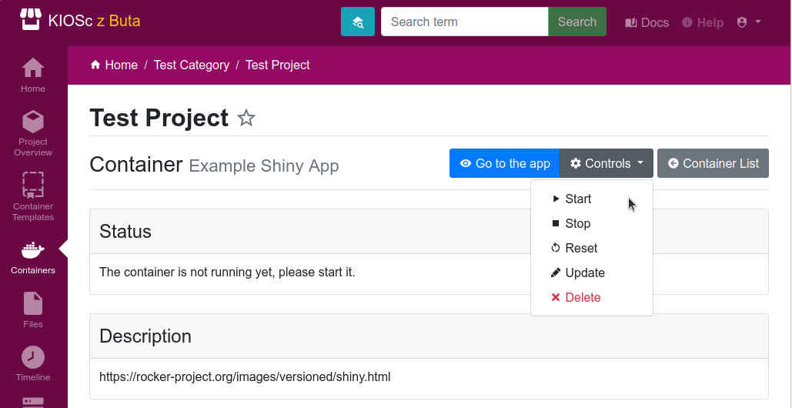
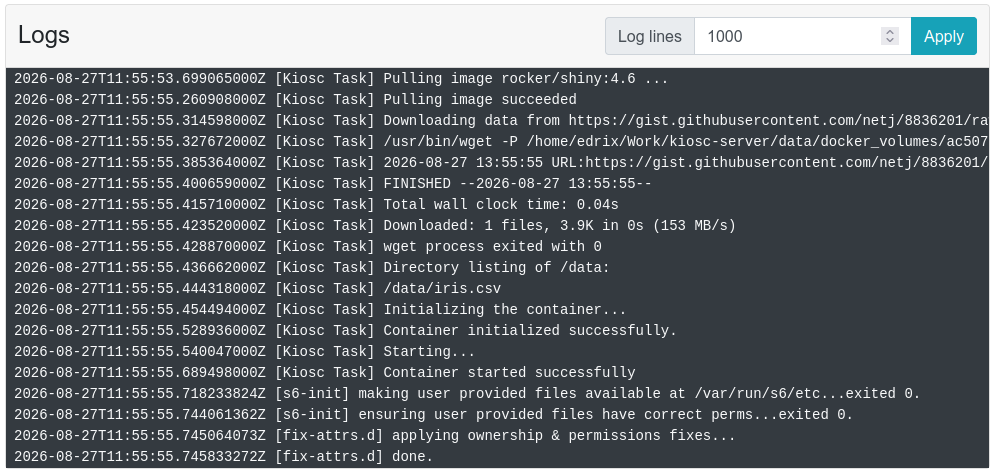
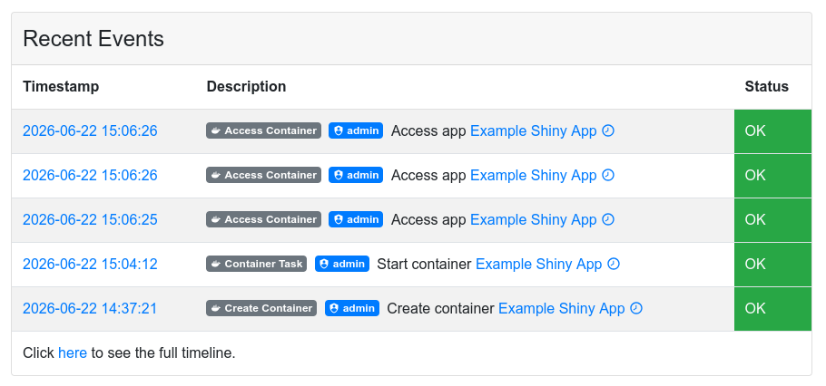

.. _apps_containers_details:

Details
=======

Click on the title of a container to access its details and the logs.
You will also be forwarded to the details once you created a container object.
A detailed description of all the fields can be found below.

.. contents::

Initial container
^^^^^^^^^^^^^^^^^

When you create a container, the detail page will provide you with information about the container object.
Please note that the container is still in initial state and not running yet.

The "Status" box tells you about the current state of the container.
If any errors occur, they will also appear here.

The "Description" box repeats the description you chose to give to your container.

Then come the "Logs", which report two types of entries:

- Actions performed on the container.
- Logs coming from the app inside the container.

The "Recent Events" table displays a timeline of all the events related to the container, including who and when accessed it.

Finally, the "Details" card provides the technical details of the container, which normally shouldn't concern you too much, unless you want to change something.

To start the container, open the Controls menu located on the
right-hand side of the title and click the ``Start`` item. The Docker container
will be created and started. This menu also provides you with the
options to edit (``Update``) or ``Delete`` the container.

Running container
^^^^^^^^^^^^^^^^^

Once the container is running, the logs will be updated in real time with entries coming mostly from the container itself.
However, for convenience, container actions triggered either by users or backgrond jobs (such as stopping the container) will also be logged.

When a user opens the container app, an entry will be created in the container timeline.

Container Details Card
^^^^^^^^^^^^^^^^^^^^^^

The container details card is a low-level description of the container object.
A few clarifications are in order.
Names of sensitive environment variables can be entered in the ``Environment secret keys`` field.

If you have set an ``environment`` and registered ``environment_secret_keys``,
the value of the corresponding items in the environment dictionary are displayed in Kiosc
as ``<masked>``, indicating that they are available to the system but
are not displayed for security reasons. However, they will still be visible
in plain in the container environment.

Similary, if your container image comes from a private registry, the username and password fields will not be shown.
Instead, the "Registry credentials" field will only show whether the image is password-protected or not.
