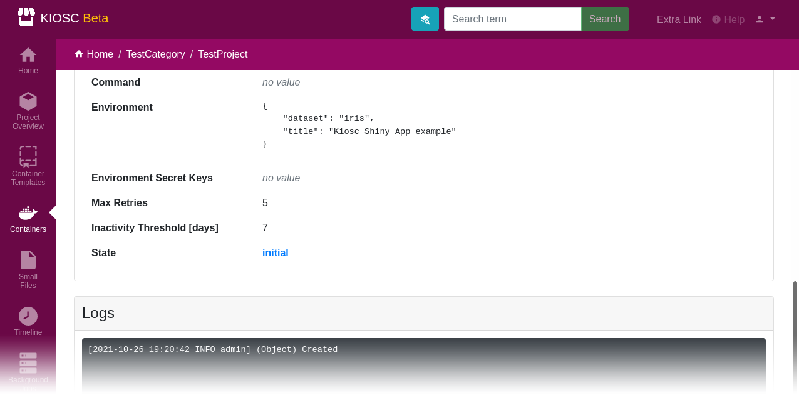

.. _apps_containers_details:

Details
=======

Click on the title of a container to access its details and the logs.
You will also be forwarded to the details once you created a container object.
A detailed description of all the fields can be found below.

.. contents::

Initial container
^^^^^^^^^^^^^^^^^

When you created a container, the detail page will provide
you with information about the container object. Please note
that the container is still in initial state and not running yet.
Thus, the button to access the proxy (eye icon) is not active.

In the bottom of the page the logs are displayed. In this case
the logs only contain one entry, indicating that the object
has been created.

To start the container, open the operator menu located on the
right-hand side of the title and click the ``Start`` item. The Docker container
will be created and started. This menu also provides you with the
options to edit (``Update``) or ``Delete`` the container.

Running container
^^^^^^^^^^^^^^^^^

Once the container is running, the detail page for the container
changes. The operator menu will change its entries, the button
to access the proxy server with the eye icon will turn blue and
the state of the container will be set to ``running``.

The logs will be updated and now contain the logs coming
from the Docker container.

When a user accesses the container via the proxy URL (which
is triggered by clicking the button with the eye icon),
this will also be displayed in the logs. Look out for an entry
that is provided by ``(Proxy)``, starting with ``Accessing [...]``.

Fields
^^^^^^

Environment & Environment Secret Keys
~~~~~~~~~~~~~~~~~~~~~~~~~~~~~~~~~~~~~

Names of sensitive environment variables can be entered in the ``Environment secret keys`` field.

If you have set an ``environment`` and registered ``environment_secret_keys``,
the value of the corresponding items in the environment dictionary are displayed in Kiosc
as ``<masked>``, indicating that they are available to the system but
are not displayed for security reasons. However, they will still be visible
in plain in the container environment.

State
~~~~~

The current state is presented and highlighted:

- **initial**, indicating that the database object has been created but no actual Docker container exists yet.
- **running**
- **failed**, indicating that something went wrong
- **exited**
- **paused**

If there is a small bell icon next to the state, this indicates
that the last user action and the current state of the Docker container
do not match.

Last action
~~~~~~~~~~~

The last action performed on the container of any user is displayed, if available.
If there is an inconsistency found between the actual Docker state and the last
user action (indicated by the bell icon right to the state), a cron job running
every few minutes tries to perform the last known issued user action. The first
number next to the action is a counter, indicating how many times it tried to re-perform the action,
with the maximal limit indicated by the second number.

Date of latest Docker log
~~~~~~~~~~~~~~~~~~~~~~~~~

When a Docker log has been fetched in the past, this date indicates the
timestamp of the latest Docker log and synchronisation of the Docker
state. Docker logs are not displayed immediately in the log file but
fetched by a background process every few minutes. This line is missing
when there are no fetched Docker logs.

Logs
~~~~

The logs will update themselves every half minute. As described above, Docker logs
are also fetched only every few minutes from the Docker container, thus there can
be a bit of latency until logs are displayed.

The log window combines logs from multiple sources. The structure of a log entry is::

    [YYYY-MM-DD HH:MM:SS <LOG_LEVEL> <USER>] (<PROCESS>) <MESSAGE>

For example::

    [2021-09-08 22:57:26 INFO anonymous] (Task) Syncing last registered container state (running) with current Docker state (exited)

Currently the following sources can contribute to the log:

- **Task:** Logs reported by automatically running background tasks. Usually they are issued by ``anonymous``.
- **Docker:** Logs reported by Docker for this container. They are fetched every half minute, so they might not appear immediately.
- **Action:** Any action the user issues on the container.
- **Proxy:** Issued when accessing the proxy.
- **Object:** Issued when changes in the database object are made that represents the Container in Kiosc.
