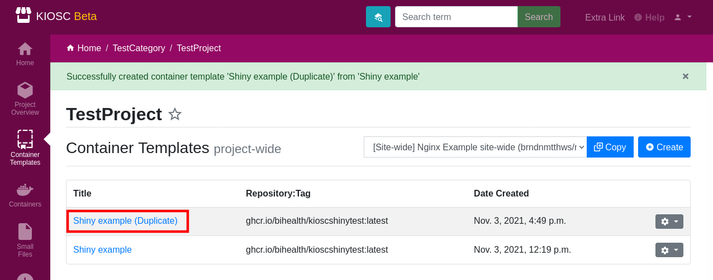

.. _apps_containertemplates_controls:

Controls
========

The ``Controls`` dropdown menu (cog icon) comprises
multiple actions that can be issued on template.

.. contents::

Update
^^^^^^

Click this to enter the update form of the template.

Duplicate
^^^^^^^^^

Duplicate is similar to the ``Copy`` action, only that you will make a copy or duplicate
of the template this menu is referring to. A new template with the same title will
show up in the list, only that the title is extended by ``(Duplicate)``.
The result is otherwise the same as when the user would make a copy of that template
with the ``Copy`` action. This means it is just a shortcut to copy templates around
within a template, while the ``Copy`` action is designed to copy templates across projects
or to copy site-wide templates.

Delete
^^^^^^

Delete deletes the template. This action needs a confirmation and can't be undone.

