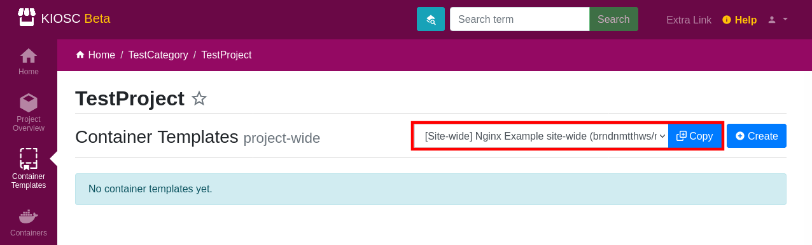
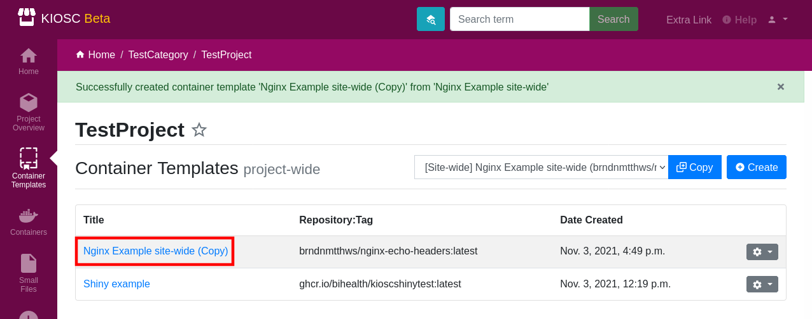

.. _apps_containertemplates_copy:

Copy
====

Select a template from the top-hand dropdown menu and click ``Copy`` to make
a copy of the selected template.

A new template with the same title will show
up in the list, only that the title is extended by ``(Copy)``.

In the dropdown menu all templates are listed the current user has access to,
plus the site-wide templates. This enables the user to copy templates from other projects.
