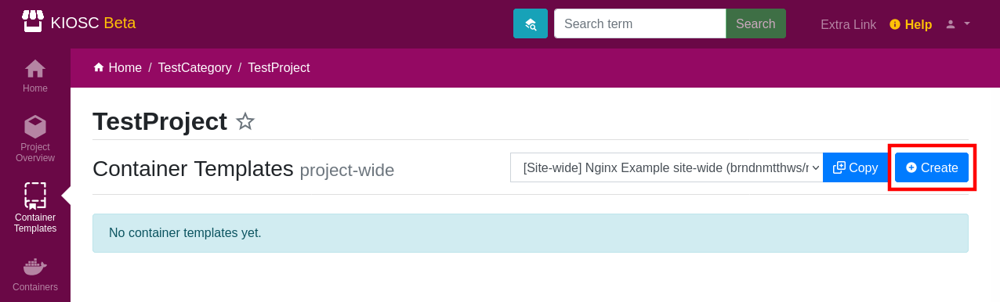
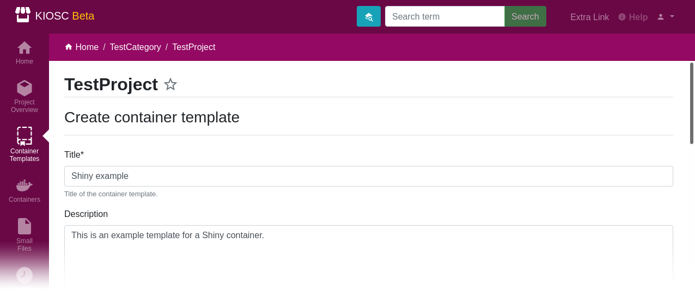
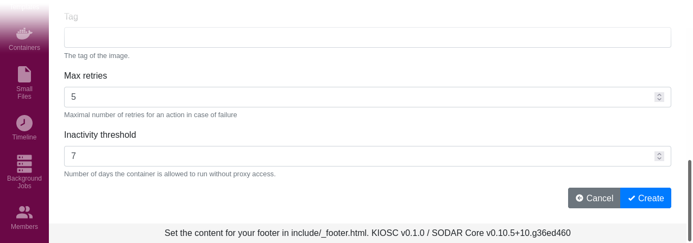
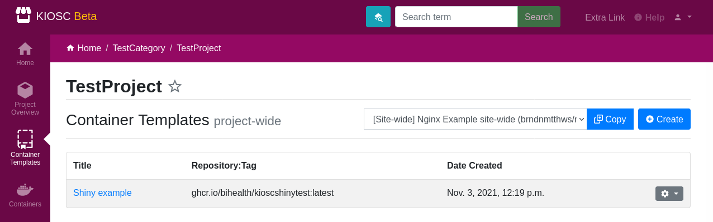

.. _apps_containertemplates_create:

Create
======

Click ``Create`` to enter the form to create a template.

The only mandatory field is ``Title``, which is also unique.
Everything else can be left out,
although some values should be set as the template makes no sense otherwise.

Create the template by clicking ``Create``.

In the overview, the container template will be listed.

