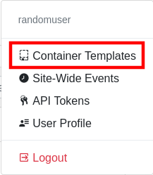

.. _apps_containertemplates_overview:

Overview
========

Find the ``Container Templates`` icon in the left-hand menu to open the Container Template
app. This will list all available container templates and offers the menus to
create, update and delete templates.

Note that the new templates will be visible in all your projects on the
KIOSC site.

Site-wide templates
^^^^^^^^^^^^^^^^^^^

The site-wide container templates can be found in the settings menu.

The difference between project-wide templates and site-wide templates
is that only administrators can create site-wide templates, and as the
name suggests are available on the entry site, i.e. can be used in every
project. Project-wide templates are created in a specific project but
can be accessed in every project the user has access to.
