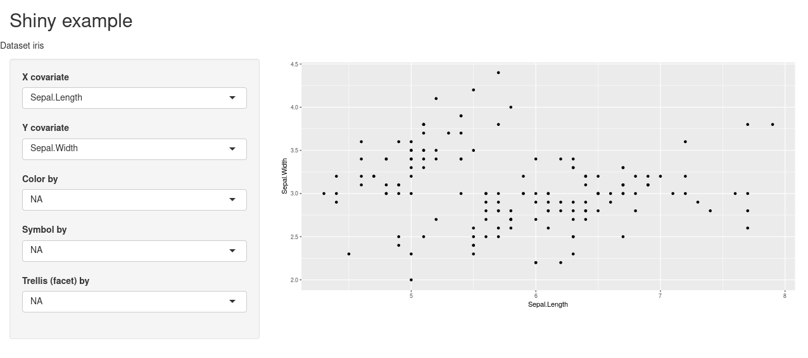
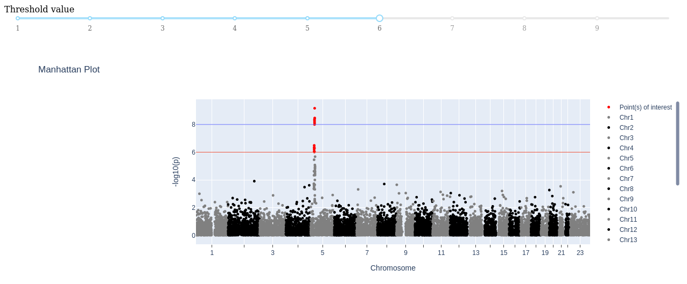
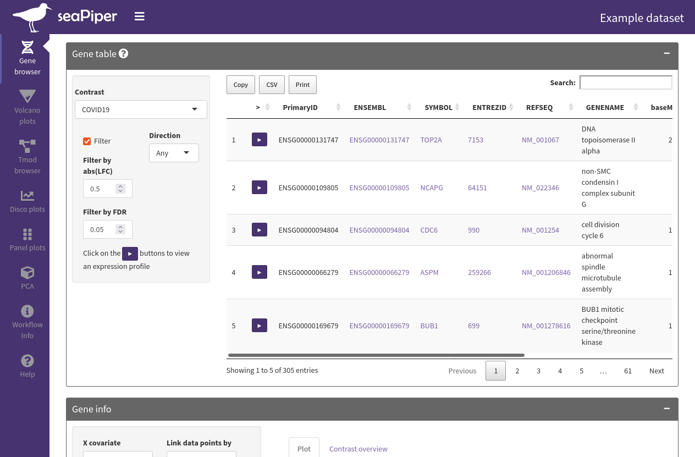
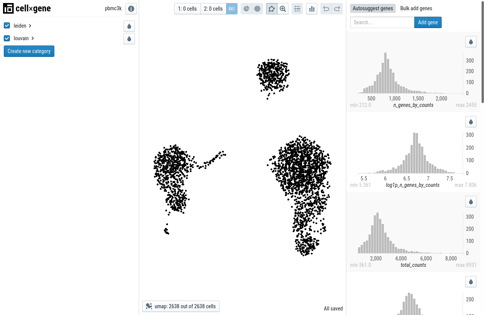
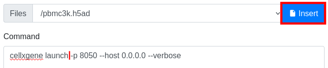
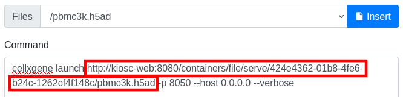
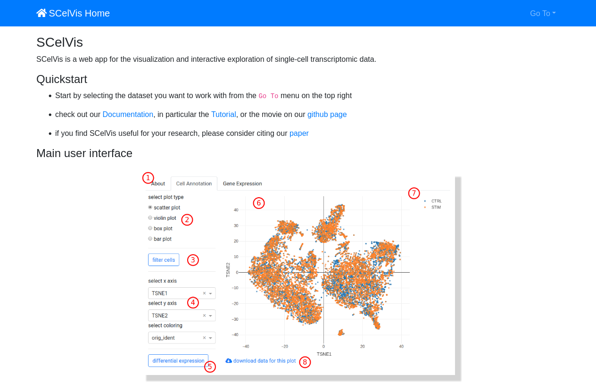

.. _introduction_cookbook:

Cookbook
========

.. contents::

Guest accessing the web interface of a container
------------------------------------------------

You are a guest of a project. You can list the containers
of the project, and access the details of each container. You can't
change the status of a container, except indirectly by viewing
a container that is not running. Probably you like to access
the web interface provided by the container.

To proceed, click on a project and then select the **Container** app.
This will display a list of all containers in the project. On the right-hand
side of each container is a button with an eye icon. The button might be
either gray-outlined with a crossed-out eye, or with a blue background
with an open eye. The crossed-out eye indicates that the container is
not running and this will also be reflected in the state. The blue open
eye indicates that the container is available. No matter the state,
clicking the icon will open the web interface provided by the container.
The difference is that in the crossed-out state Kiosc tries to start the
container before accessing the web interface which might take some time
while in the running state the web interface will be displayed immediately.

Create a container running ...
------------------------------

To create a container switch to the **Containers** app

.. image:: figures/apps/containers/menu.png
  :alt: Container app

and select **Create Container**. This will be the starting point
for the following tutorials.

.. image:: figures/apps/containers/overview_create.png
  :alt: Project overview

After the creation of the container you will be redirected
the details of the container. The state will be set to
``initial`` which indicates that there is the container object
but no actual Docker container (yet). You can find the operations menu (cog icon)
on the top right of the details page. Open the dropdown
menu by clicking the cog icon and select **Start**, or click
the crossed-out eye icon to start and access the container directly.

Shiny (using environment variables)
^^^^^^^^^^^^^^^^^^^^^^^^^^^^^^^^^^^

*For this tutorial we provide you with a pre-build*
`Docker image with a Shiny application <https://github.com/bihealth/kiosc-example-shiny/>`_.
*Use the linked repository as a base to create your own Docker image.*

This example sets up a simple Shiny application loading the popular iris dataset.
The data set is loaded by setting the ``dataset`` variable in the environment.
Fill out the following fields and click **Create**:

==================  ==================================================================
**Title**           *Set a unique title that helps you identify the container easily.*
**Repository**      ``ghcr.io/bihealth/kioscshinytest``
**Tag**             ``latest``
**Container Port**  ``8080``
**Environment**     ``{"title": "Kiosc Shiny App example", "dataset": "iris"}``
==================  ==================================================================

The **Environment** field should contain a `JSON object literal <https://www.w3schools.com/js/js_json_objects.asp>`_,
which corresponds to a Python dictionary with the exception that only double quotes are allowed, or nothing.

The value in the **Environment** field will be transformed and passed to the environment of
the container. In the above example, the Docker container will hold two environment variables.
Imagine that inside the container the following lines will be performed upon start::

    $ export title="Kiosc Shiny App example"
    $ export dataset=iris

Dash (using environment variables)
^^^^^^^^^^^^^^^^^^^^^^^^^^^^^^^^^^

*For this tutorial we provide you with a pre-build*
`Docker image with a Dash application <https://github.com/bihealth/kiosc-example-dash/>`_.
*Use the linked repository as a base to create your own Docker image.*

In this example we are running a Dash application. As we are behind
a reverse proxy, the Dash application needs some tweaks to make it load
all scripts and stylesheets into the container when started. The Dash
application was extended by accepting an environmental variable named
``PUBLIC_URL_PREFIX``, and for this to work, you have to set up this
environment variable and set it to the value ``__KIOSC_URL_PREFIX__``.
This acts as a place holder that is substituted with the path to the
container how it is known to the outside. Fill out the following fields and click **Create**:

==================  ==================================================================
**Title**           *Set a unique title that helps you identify the container easily.*
**Repository**      ``ghcr.io/bihealth/kiosc-example-dash``
**Tag**             ``main-0``
**Container Port**  ``8050``
**Environment**     ``{"PUBLIC_URL_PREFIX": "__KIOSC_URL_PREFIX__"}``
==================  ==================================================================

The **Environment** field should contain a `JSON object literal <https://www.w3schools.com/js/js_json_objects.asp>`_,
which corresponds to a Python dictionary with the exception that only double quotes are allowed, or nothing.

The value in the **Environment** field will be transformed and passed to the environment of
the container. In the above example, the Docker container will hold two environment variables.
Imagine that inside the container the following lines will be performed upon start::

    $ export PUBLIC_URL_PREFIX=containers/proxy/abcdef123...

seaPiper
^^^^^^^^

*For this tutorial we provide you with a pre-build*
`Docker image with a seaPiper application <https://github.com/bihealth/kiosc-seapiper-demo/>`_.
*Use the linked repository as a base to create your own Docker image.*

seaPiper is based on Shiny. Fill out the following fields and click **Create**:

==================  ==================================================================
**Title**           *Set a unique title that helps you identify the container easily.*
**Repository**      ``ghcr.io/bihealth/kiosc-seapiper-demo``
**Tag**             ``latest``
**Container Port**  ``8080``
==================  ==================================================================

cellxgene (using a command)
^^^^^^^^^^^^^^^^^^^^^^^^^^^

This example takes a publicly available container and passes a command that is run
when starting the container. In this case, the cellxgene application is started
immediately when running the container. The data is loaded by passing the data
URL to the command. Fill out the following fields and click **Create**:

==================  ==================================================================
**Title**           *Set a unique title that helps you identify the container easily.*
**Repository**      ``quay.io/biocontainers/cellxgene``
**Tag**             ``1.0.0--pyhdfd78af_0``
**Container Port**  ``8050``
**Command**         ``cellxgene launch https://cellxgene-example-data.czi.technology/pbmc3k.h5ad -p 8050 --host 0.0.0.0 --verbose``
==================  ==================================================================

cellxgene (using a command with small files)
^^^^^^^^^^^^^^^^^^^^^^^^^^^^^^^^^^^^^^^^^^^^

This example is the same as above but using a file uploaded to Kiosc.
A command to copy-and-paste can't be provided as the link to the file
depend on the UUID that is randomly created. To get the file into Kiosc,
download the file from the official server and upload it to Kiosc:

1. Download `example data <https://cellxgene-example-data.czi.technology/pbmc3k.h5ad>`_.
2. Go to a Kiosc project and select the :ref:`Small Files app <apps_filesfolders>`.
3. Upload the ``pbmc3k.h5ad`` file. It is now available during container creation.

Now continue with the container creation. To make use of the uploaded file, when
inserting the command, place the cursor at the mentioned position in the command,
select the file and click *Insert*.

This will place a link at the cursor position.

==================  ==================================================================
**Title**           *Set a unique title that helps you identify the container easily.*
**Repository**      ``quay.io/biocontainers/cellxgene``
**Tag**             ``1.0.0--pyhdfd78af_0``
**Container Port**  ``8050``
**Command**         ``cellxgene launch <PLACE_CURSOR_HERE_BEFORE_INSERTING_FILE> -p 8050 --host 0.0.0.0 --verbose``
**Files**           ``/pbmc3k.h5ad``
==================  ==================================================================

ScElvis (using a command and environment variables)
^^^^^^^^^^^^^^^^^^^^^^^^^^^^^^^^^^^^^^^^^^^^^^^^^^^

This example sets up the ScElvis. ScElvis is based on Dash.
For this to work, you have to set up two environment variables,
``SCELVIS_URL_PREFIX`` helps the application alter the URL path
to load scripts and style sheets into the container and
``SCELIVS_DATA_URL`` sets the data that is to be loaded into the
container. Fill out the following fields and click **Create**:

==================  ==================================================================
**Title**           *Set a unique title that helps you identify the container easily.*
**Repository**      ``ghcr.io/bihealth/scelvis``
**Tag**             ``v0.8.6``
**Container Port**  ``8050``
**Environment**     ``{"SCELVIS_URL_PREFIX": "__KIOSC_URL_PREFIX__", "SCELVIS_DATA_SOURCES": "https://cellxgene-example-data.czi.technology/pbmc3k.h5ad"}``
**Command**         ``scelvis run``
==================  ==================================================================

The **Environment** field should contain a `JSON object literal <https://www.w3schools.com/js/js_json_objects.asp>`_,
which corresponds to a Python dictionary with the exception that only double quotes are allowed, or nothing.

The value in the **Environment** field will be transformed and passed to the environment of
the container. In the above example, the Docker container will hold two environment variables.
Imagine that inside the container the following lines will be performed upon start::

    $ export SCELVIS_URL_PREFIX=containers/proxy/abcdef123...
    $ export SCELVIS_DATA_SOURCES=https://cellxgene-example-data.czi.technology/pbmc3k.h5ad

In addition to the user defined variables, the ``title``, ``description`` and
``container_port`` are also exposed as environment variables to the Docker container
(as ``TITLE``, ``DESCRIPTION`` and ``CONTAINER_PORT`` respectively)::

    $ export TITLE="Some unique title"
    $ export DESCRIPTION="Some description"
    $ export CONTAINER_PORT=8050
