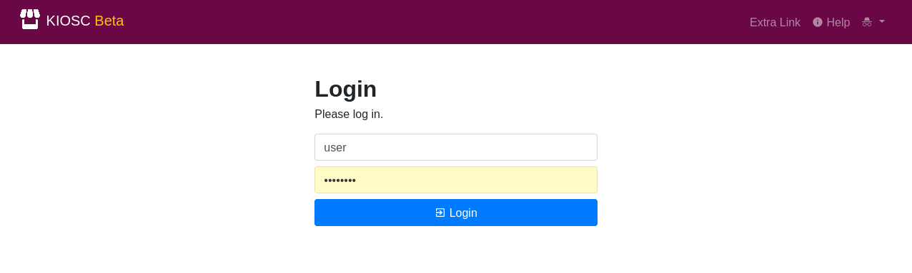
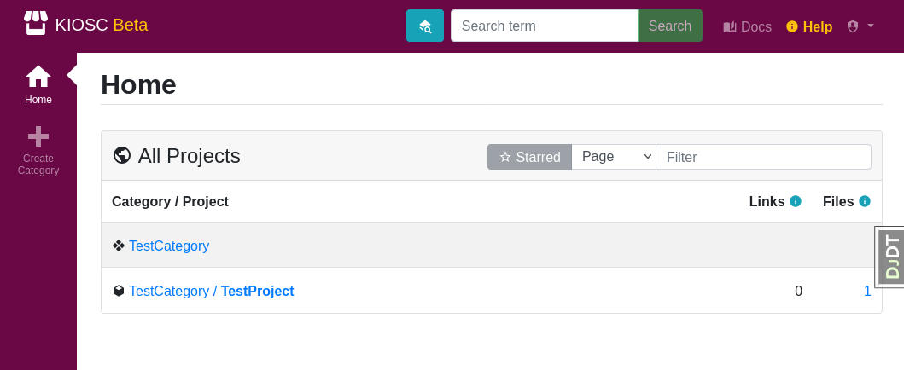
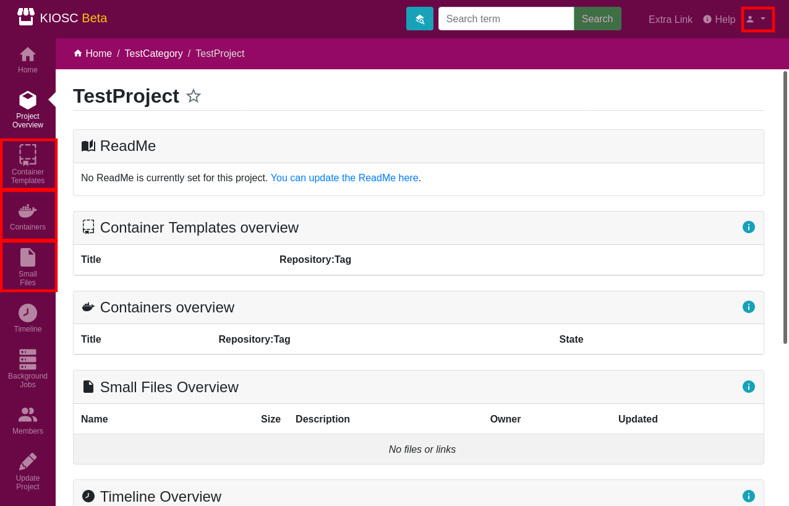
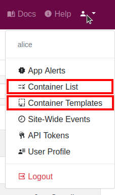

.. _introduction_interface:

Interface
=========

When accessing the Kiosc web interface, one is greeted
with the Kiosc logo and a login form. You need to have an
account with Kiosc or the LDAP must be configured to be
able to log in with your institute account. Approach your
system administrator about that matter if you are unsure.

.. note::

    This documentation assumes a basic familiarity with some Docker terms,
    such as *containers*. Refer to :ref:`introduction_docker` for a brief
    explanation.

Managing Containers and Container Templates
-------------------------------------------

Once logged in, you will see an overview of all the projects available to your user.

In Kiosc, projects are organized into categories and sub-categories. A category
can be viewed as a folder containing multiple projects or sub-categories.
Only the administrator can create a new top-level category. If you don't see
any projects in your home page, get in touch with your system administrator.
Otherwise, you can browse the available categories and projects, and even create
new ones inside an existing top-level category.

.. tip::

    If you have worked with `SODAR <https://github.com/bihealth/sodar-server>`__
    before, the Kiosc homepage with the project list may look familiar. While
    Kiosc can be run as a standalone app, it is based on the same `framework
    <https://github.com/bihealth/sodar-core>`__ of SODAR, and it can optionally
    be linked to an existing SODAR web site. When Kiosc is liked to a SODAR
    instance, projects and users can be imported from there.

    If you do expect to have access to a project you cannot find in the list,
    ask the leader or delegate of that project to grant you access to that
    project. If the Kiosc instance is linked to a SODAR instance, the access is
    set in SODAR and must then be synchronized to Kiosc by the administrator.

To be able to access the Kiosc apps, click on a project. You should see
something similar to this:

On the left-hand side bar you can find the Kiosc apps, specialized pages that
provide the functionality you need. The three most important apps, highlighted
in the figure, are:

1. **Container Templates**, for creating reusable templates for Docker
   containers (:ref:`detailed docs <apps_containertemplates>`);
2. **Containers**, for creating and controlling Docker containers
   (:ref:`detailed docs <apps_containers>`);
3. **Small Files**, for uploading small files (< 2GB) that the containers
   can then access (:ref:`detailed docs <apps_filesfolders>`).

Additionally, in the top-right corner is a drop-down menu for account settings and
site apps. This gives access to the site-wide container template app. This hosts
container templates that are accessible site-wide and not project-wide.

Searching Containers and Logs
-----------------------------

At the center of the top bar you will find the search box. You
can use it to search objects such as containers, small files,
site events, and log entries. Searching in KIOSC follows the same
principles as in SODAR Core (you can read more about it `here
<https://sodar-core.readthedocs.io/en/latest/app_projectroles_usage.html#search>`__).
Briefly, you can enter search terms but also restrict the results to
certain object types and limit the search to a particular project. Search is
best explained by example, so here are a few strings that you can enter in the
search box along with an explanation of what they do.

``seapiper``
  search all projects, files, timeline events, containers, and logs that contain
  the string "seapiper"

``seapiper type:container``
  search all *containers* with "seapiper" in the title, description, or
  repository

``proteomics type:container``
  search all *containers* with "proteomics" in the title, description, or
  repository

``seapiper type:containerbackgroundjob``
  search all *container background jobs* related to "seapiper" containers

``seapiper type:containerlogentry``
  search all *container log entries* containing the string "seapiper"

``error type:containerlogentry project:0f0556cf-0e9f-4923-b2b9-49e573b893f0``
  search for errors in log entries for the project with UUID
  ``0f0556cf-0e9f-4923-b2b9-49e573b893f0``

For complex searches involving multiple terms you can press the *Advanced
Search* button to the left of the search box.
