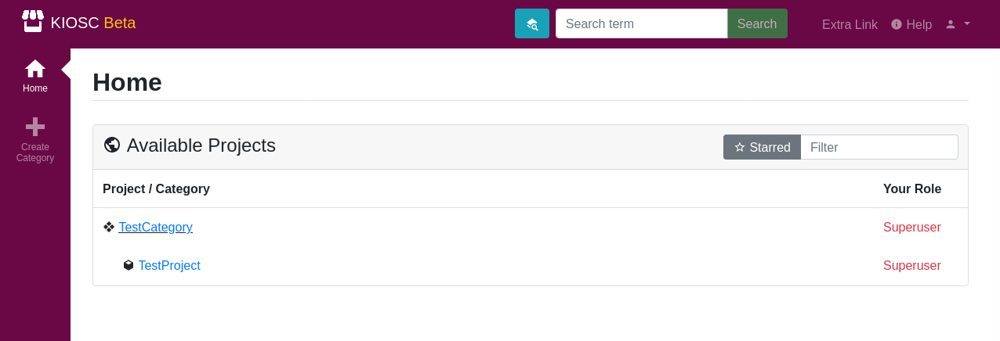

.. _introduction_interface:

Interface
=========

When accessing the Kiosc web interface, one is greeted
with the Kiosc logo and a login form. You need to have an
account with Kiosc or the LDAP must be configured to be
able to log in with your institute account. Approach your
system administrator about that matter if you are unsure.

Once logged in, you will see an overview of all the projects
you are assigned to, alike SODAR. If you do expect to have
access to a project you do not have access to, ask the leader or
delegate of that project to grant you access to that project.
If the Kiosc instance is linked to a SODAR instance, the access
is set in SODAR and must then be synchronized to Kiosc by the
administrator.

To be able to access the Kiosc apps, click on a project. On the
left-hand side you will have access to multiple apps, three
of them are of interest:

1. **Containers** for creating and controlling Docker containers.
2. **Container Template** for creating templates for Docker containers.
3. **Small Files** for uploading smaller files that the containers can then access.

Additionally, in the top-right corner is a drop-down menu for account settings and
site apps. This gives access to the site-wide container template app. This hosts
container templates that are accessible site-wide and not project-wide.

.. image:: figures/introduction/interface/settings_menu.png
  :alt: Settings menu
