.. _introduction_cookbook:

Cookbook
========

.. contents:: Contents
   :local:

Creating a project
------------------

After you log in, you should see the home page with the projects list. In Kiosc,
like in `SODAR <https://github.com/bihealth/sodar-server>`__, projects are
organized hierarchically in *categories*. A category is a directory that can
contain projects or other categories. If no project exists, you can create one
yourself within an existing category. Only an administrator with superuser
access can create top-level categories, by clicking on "Create Category" in the
left side menu.

To create a project, navigate to the desired category, then click on "Create
Project or Category" in the menu on the left side. The project page will show
you an overview of the containers, container templates, and files that belong to
this project. Initially, everything will be empty.

Accessing containers in a project
---------------------------------

If an administrator or another user have created a project, they may have given
you access to it. In Kiosc, users can have various roles in a project; check out
the :ref:`relevant documentation <introduction_roles>` for reference. If you are
a member of the project, you will be able to see the containers in that project.
Depending on your role, you may or may not be able to modify the containers,
stop them, and restart them, but you should always be able to access them. To
access the web app inside a container, browse to the project of interest, find
the container, and click on its title. You should see the container status page,
and if you click on the eye icon, you'll be redirected to the container's app.

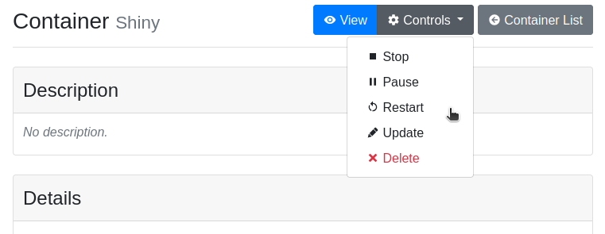

The button with the eye icon also indicates the status of the container. If
they button is colored in gray and the eye is crossed-out, it means that the
container is not running. If the button is blue with an open eye, it means
that the container is running. Even if the container is not running, clicking
on the button will start it and redirect you to the web app. If you have the
appropriate role in the project, you will also see the :guilabel:`Controls`
button for changing the state of the container.

.. note::

    If the container needs to be started, it may take some time before it
    becomes available. When Kiosc says that the container is running, but
    you cannot access it, it means that the container is starting up. Please
    be patient and come back after several minutes. If, after one hour, the
    container is still inaccessible, report this to the project owner or the
    container developer.

Controlling containers
----------------------

A Docker container can be in different states, and this is reflected in Kiosc.

- **Initial**: The image was just downloaded and the container has not been
  started for the first time yet.
- **Running**: The container is running and you can access the service provided
  by the container.
- **Paused**: The processes inside the container are sleeping and do not consume
  resources, but can be restarted at any time.
- **Stopped**: The container has been killed by a user.
- **Failed**: Something went wrong inside the container, you should report this
  error to the container's authors.

Controlling a container means changing its state, and your user needs to have
the appropriate permission to do so. In Kiosc, there are three places where
containers can be managed. One is the container detail page, as shown in the
figure above. To access that, navigate to the corresponding project from the
home page, then click on the container title.

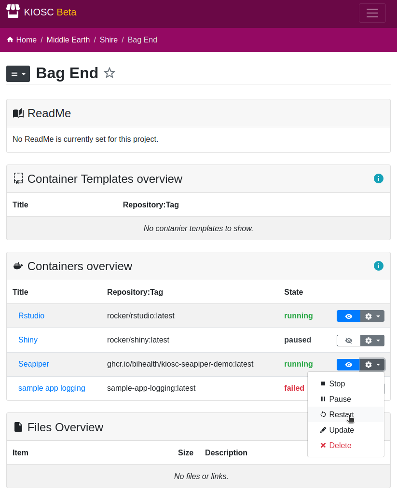

The second place which allows you to control the containers is the project page.
There, you will find a section called :guilabel:`Containers overview` listing all the containers belonging to that project.
By clicking on the gear icon, you will access the controls menu.

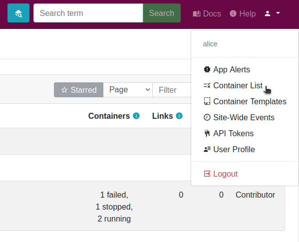

Finally, clicking on the user menu at the top-right corner, you'll be able to access the :guilabel:`Container List` app.
There, you will find a view similar to the Containers overview, except that it will show all your container, regardless of the project they are in.

Creating a container for...
---------------------------

This section illustrates how to create containers. For concreteness, we describe
a few real-world use cases that, in our experience, occur often in practice.

If you want to create a container, navigate to the project where you want to
have it, and make sure you have a :ref:`role <introduction_roles>` that allows
you to create containers. Switch to the :guilabel:`Containers` app

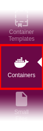

and select :guilabel:`Create Container`. This will be the starting point
for the following tutorials.

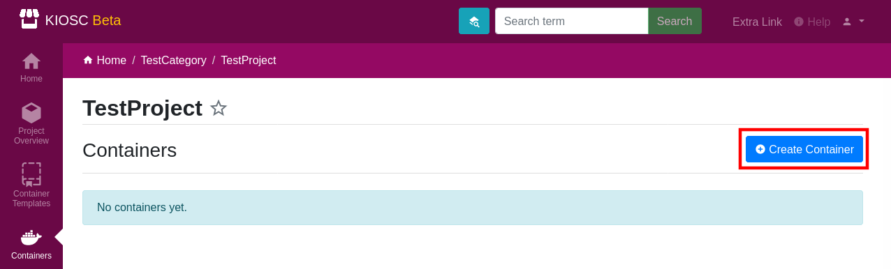

At this point you can simply fill out the form with the container details.
You'll need to know the repository where the container should be downloaded
from (typically `Docker Hub <https://hub.docker.com>`__, `GitHub Container
Registry <https://ghcr.io>`__, or a similar platform). You will also need to
know the port on which the app inside the container listens to; this should
be specified in the container's documentation. If you want, you can pass
environment variables to the app or customize the command to run. The following
subsections will describe in detail how to set up a container using specific
examples.

After the creation of the container you will be redirected the details of the
container. The state will be set to ``initial`` which indicates that there
is the container object but no actual Docker container (yet). You can find
the operations menu (cog icon) on the top right of the details page. Open the
dropdown menu by clicking the cog icon and select **Start**, or click
the crossed-out eye icon to start and access the container directly.

Shiny
^^^^^

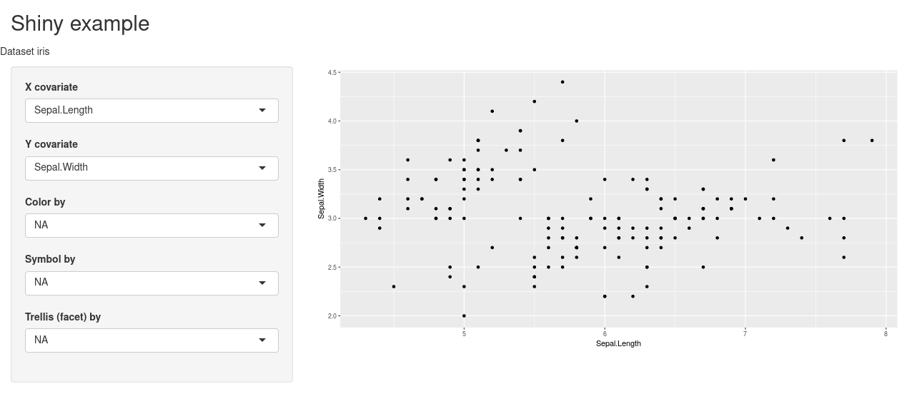

*For this tutorial we provide you with a pre-built*
`Docker image with a Shiny application <https://github.com/bihealth/kiosc-example-shiny/>`_.
*Use the linked repository as a base to create your own Docker image.*

This example sets up a simple `Shiny <https://shiny.posit.co/>`__
application loading the popular `Iris dataset
<https://www.rdocumentation.org/packages/datasets/versions/3.6.2/topics/iris>`__.
The data set is loaded by setting the ``dataset`` variable in the environment.
Fill out the following fields and click :guilabel:`Create`:

==================  ==================================================================
**Title**           *Set a unique title that helps you identify the container easily.*
**Repository**      ``ghcr.io/bihealth/kioscshinytest``
**Tag**             ``latest``
**Container Port**  ``8080``
**Environment**     ``{"title": "Kiosc Shiny App example", "dataset": "iris"}``
==================  ==================================================================

The **Environment** field should contain a `JSON object literal
<https://www.w3schools.com/js/js_json_objects.asp>`_, which corresponds to a
Python dictionary with the exception that only double quotes are allowed, or
nothing.

The value in the **Environment** field will be transformed and passed to the
environment of the container. In the above example, the Docker container will
hold two environment variables. Imagine that inside the container the following
lines will be performed upon start::

    $ export title="Kiosc Shiny App example"
    $ export dataset=iris

Dash
^^^^

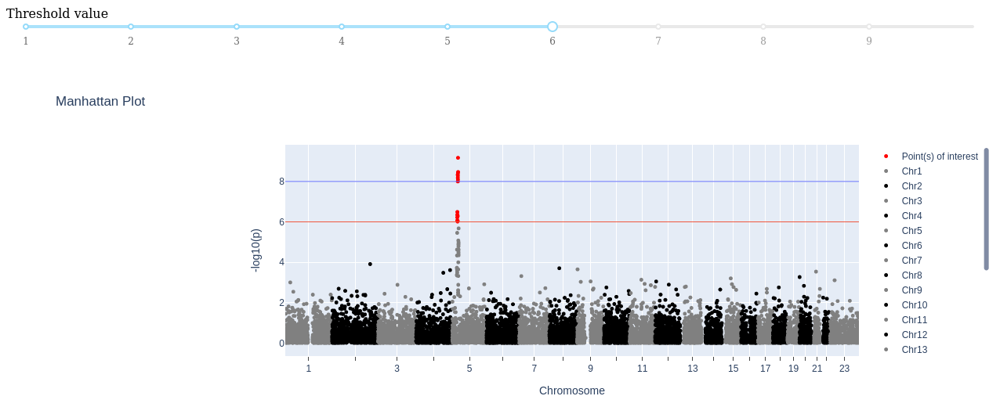

*For this tutorial we provide you with a pre-built*
`Docker image with a Dash application <https://github.com/bihealth/kiosc-example-dash/>`_.
*Use the linked repository as a base to create your own Docker image.*

In this example we are running a `Dash <https://dash.plotly.com/>`__
application. As we are behind a reverse proxy, the Dash application needs
some tweaks to make it load all scripts and stylesheets into the container
when started. The Dash application was extended by accepting an environmental
variable named ``PUBLIC_URL_PREFIX``, and for this to work, you have to set up
this environment variable and set it to the value ``__KIOSC_URL_PREFIX__``.
This acts as a place holder that is substituted with the path to the container
how it is known to the outside. Fill out the following fields and click
:guilabel:`Create`:

==================  ==================================================================
**Title**           *Set a unique title that helps you identify the container easily.*
**Repository**      ``ghcr.io/bihealth/kiosc-example-dash``
**Tag**             ``main-0``
**Container Port**  ``8050``
**Environment**     ``{"PUBLIC_URL_PREFIX": "__KIOSC_URL_PREFIX__"}``
==================  ==================================================================

The **Environment** field should contain a `JSON object literal
<https://www.w3schools.com/js/js_json_objects.asp>`_, which corresponds to a
Python dictionary with the exception that only double quotes are allowed, or
nothing.

The value in the **Environment** field will be transformed and passed to the
environment of the container. In the above example, the Docker container will
hold two environment variables. Imagine that inside the container the following
lines will be performed upon start::

    $ export PUBLIC_URL_PREFIX=containers/proxy/abcdef123...

seaPiper
^^^^^^^^

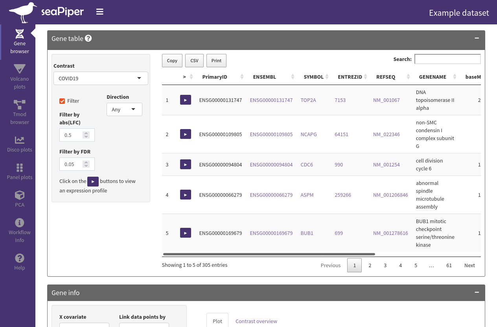

*For this tutorial we provide you with a pre-built*
`Docker image with a seaPiper application <https://github.com/bihealth/kiosc-seapiper-demo/>`_.
*Use the linked repository as a base to create your own Docker image.*

`seaPiper <https://bihealth.github.io/seaPiper/>`__ is an exploratory data
analysis app based on Shiny. Fill out the following fields and click **Create**:

==================  ==================================================================
**Title**           *Set a unique title that helps you identify the container easily.*
**Repository**      ``ghcr.io/bihealth/kiosc-seapiper-demo``
**Tag**             ``latest``
**Container Port**  ``8080``
==================  ==================================================================

CELLxGENE
^^^^^^^^^

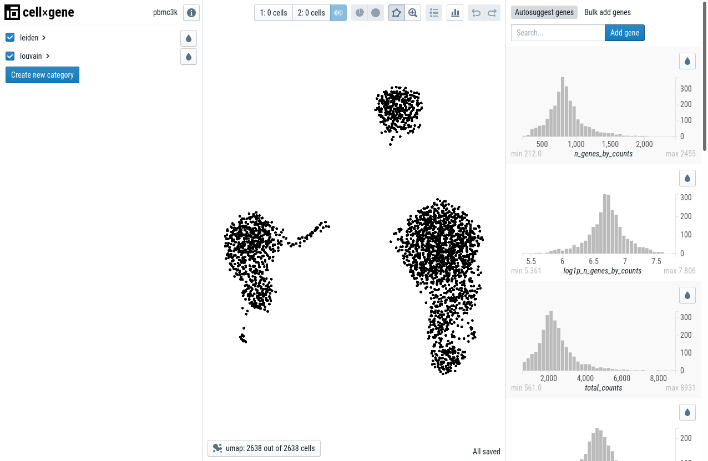

This example takes a publicly available container and passes a command
that is run when starting the container. In this case, the `CELLxGENE
<https://cellxgene.cziscience.com/>`__ application is started immediately
when running the container. The data is loaded by passing the data URL to the
command. Fill out the following fields and click **Create**:

==================  ==================================================================
**Title**           *Set a unique title that helps you identify the container easily.*
**Repository**      ``quay.io/biocontainers/cellxgene``
**Tag**             ``1.0.0--pyhdfd78af_0``
**Container Port**  ``8050``
**Command**         ``cellxgene launch https://cellxgene-example-data.czi.technology/pbmc3k.h5ad -p 8050 --host 0.0.0.0 --verbose``
==================  ==================================================================

CELLxGENE (using the files app)
^^^^^^^^^^^^^^^^^^^^^^^^^^^^^^^

This example is the same as above but using a file uploaded to Kiosc.
A command to copy-and-paste can't be provided as the link to the file
depend on the UUID that is randomly created. To get the file into Kiosc,
download the file from the official server and upload it to Kiosc:

1. Download `example data <https://cellxgene-example-data.czi.technology/pbmc3k.h5ad>`_.
2. Go to a Kiosc project and select the :ref:`Small Files app <apps_filesfolders>`.
3. Upload the ``pbmc3k.h5ad`` file. It is now available during container creation.

Now continue with the container creation. To make use of the uploaded file, when
inserting the command, place the cursor at the mentioned position in the command,
select the file and click :guilabel:`Insert`.

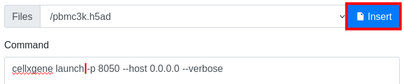

This will place a link at the cursor position.

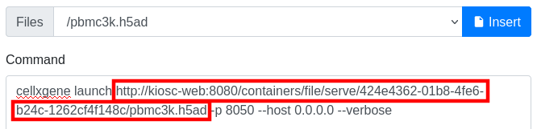

==================  ==================================================================
**Title**           *Set a unique title that helps you identify the container easily.*
**Repository**      ``quay.io/biocontainers/cellxgene``
**Tag**             ``1.0.0--pyhdfd78af_0``
**Container Port**  ``8050``
**Command**         ``cellxgene launch <PLACE_CURSOR_HERE_BEFORE_INSERTING_FILE> -p 8050 --host 0.0.0.0 --verbose``
**Files**           ``/pbmc3k.h5ad``
==================  ==================================================================

ScElvis
^^^^^^^

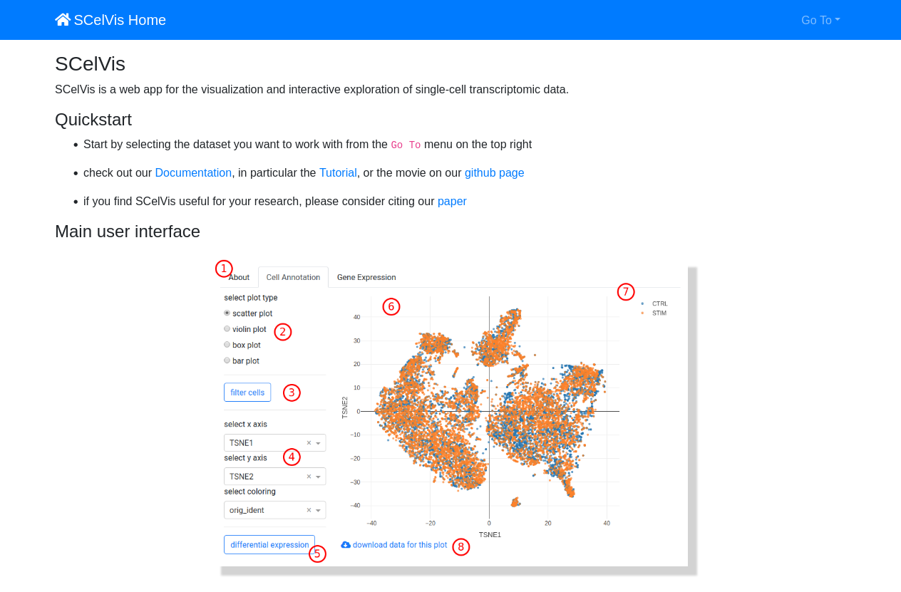

This example sets up the `ScElvis
<https://scelvis.readthedocs.io/en/latest/>`__, a single cell visualization tool
based on Dash. For this to work, you have to set up two environment variables,
``SCELVIS_URL_PREFIX`` helps the application alter the URL path to load scripts
and style sheets into the container and ``SCELIVS_DATA_URL`` sets the data that
is to be loaded into the container. Fill out the following fields and click
:guilabel:`Create`:

==================  ==================================================================
**Title**           *Set a unique title that helps you identify the container easily.*
**Repository**      ``ghcr.io/bihealth/scelvis``
**Tag**             ``v0.8.6``
**Container Port**  ``8050``
**Environment**     ``{"SCELVIS_URL_PREFIX": "__KIOSC_URL_PREFIX__", "SCELVIS_DATA_SOURCES": "https://cellxgene-example-data.czi.technology/pbmc3k.h5ad"}``
**Command**         ``scelvis run``
==================  ==================================================================

The **Environment** field should contain a `JSON object literal <https://www.w3schools.com/js/js_json_objects.asp>`_,
which corresponds to a Python dictionary with the exception that only double quotes are allowed, or nothing.

The value in the **Environment** field will be transformed and passed to the environment of
the container. In the above example, the Docker container will hold two environment variables.
Imagine that inside the container the following lines will be performed upon start::

    $ export SCELVIS_URL_PREFIX=containers/proxy/abcdef123...
    $ export SCELVIS_DATA_SOURCES=https://cellxgene-example-data.czi.technology/pbmc3k.h5ad

In addition to the user defined variables, the ``title``, ``description`` and
``container_port`` are also exposed as environment variables to the Docker container
(as ``TITLE``, ``DESCRIPTION`` and ``CONTAINER_PORT`` respectively)::

    $ export TITLE="Some unique title"
    $ export DESCRIPTION="Some description"
    $ export CONTAINER_PORT=8050
